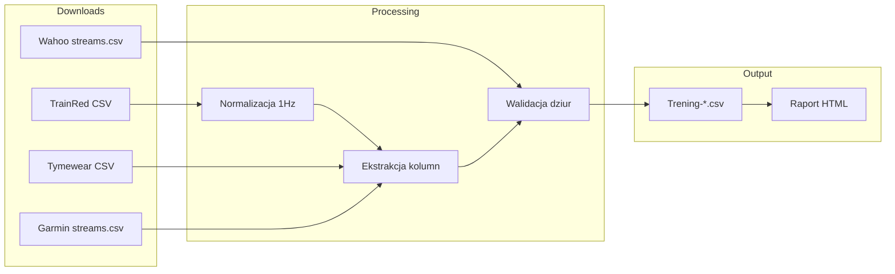
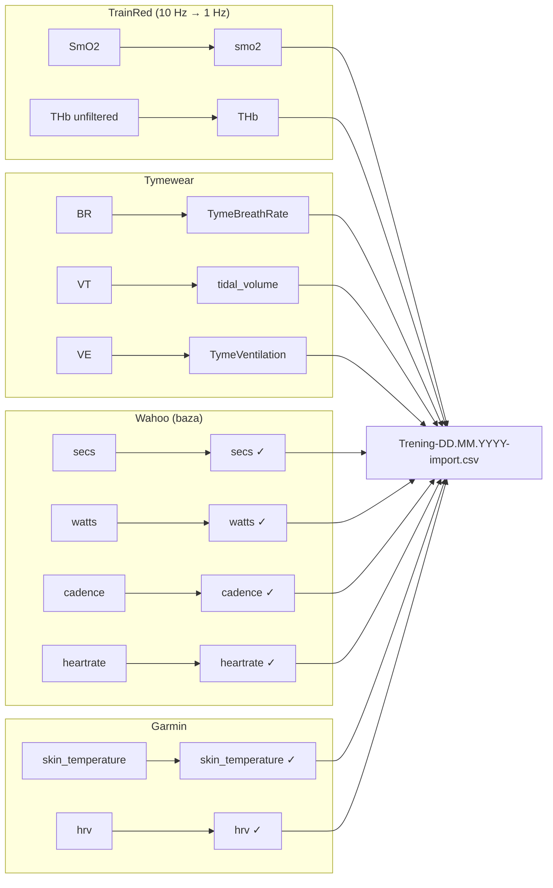

# 🏋️ Intervals Generator

> Automatyczny import i scalanie danych treningowych z wielu źródeł (TrainRed, Tymewear, Wahoo, Garmin) do jednego pliku CSV.

[](https://www.python.org/)
[](LICENSE)
[](https://github.com/WielkiKrzych/Intervals_Generator_CSV/actions/workflows/ci.yml)
[](https://codecov.io/gh/WielkiKrzych/Intervals_Generator_CSV)
[](https://badge.fury.io/py/intervals-generator-csv)

## 🚀 Quick Start (Maksymalna prostota)

Jeśli chcesz po prostu połączyć pliki CSV bez zagłębiania się w szczegóły:

1. **Używając aplikacji (macOS):**
   - Przeciągnij swoje pliki CSV (Wahoo, TrainRed, Garmin, Tymewear) na ikonę **MergeCSV.app** w głównym folderze.
   - Gotowy plik `Trening-*.csv` pojawi się obok plików źródłowych.

2. **Używając terminala:**
   - Wrzuć pliki CSV do jednego folderu.
   - Uruchom: `python3 quick_merge.py` (w tym folderze) lub `python3 ~/Desktop/Intervals_Generator/quick_merge.py *.csv`.
   - Gotowe!

---

## 📋 Spis treści

- [Opis](#-opis)
- [Przepływ danych](#-przepływ-danych)
- [Instalacja](#-instalacja)
- [Użycie](#-użycie)
- [Przykłady](#-przykłady)
- [CLI Reference](#-cli-reference)
- [Struktura projektu](#-struktura-projektu)
- [Rozwiązywanie problemów](#-rozwiązywanie-problemów)

## 🎯 Opis

Intervals Generator rozwiązuje problem integracji danych z różnych urządzeń treningowych:

| Źródło | Dane | Format wejściowy |
|--------|------|------------------|
| **TrainRed** | SmO2, THb (saturacja mięśniowa) | `session_*.csv` (10 Hz → 1 Hz) |
| **Tymewear** | BR, VT, VE (wentylacja) | CSV z nagłówkiem BR/VT/VE |
| **Wahoo** | Moc, kadencja, tętno | `*streams.csv` |
| **Garmin** | Temperatura skóry, HRV | `*streams.csv` z kolumną `hrv` |

**Wynik**: Jeden plik `Trening-DD.MM.YYYY-import.csv` zsynchronizowany czasowo.

## 🔄 Przepływ danych



## 🚀 Instalacja

### Opcja 1: pip (zalecane)

```bash
pip install intervals-generator-csv

# Z GUI (Streamlit)
pip install intervals-generator-csv[gui]

# Dla developerów
pip install intervals-generator-csv[dev]
```

### Opcja 2: Ze źródeł

```bash
# Klonowanie
git clone https://github.com/WielkiKrzych/Intervals_Generator_CSV.git
cd Intervals_Generator_CSV

# Instalacja edytowalna
pip install -e .

# Lub tylko zależności
pip install -r requirements.txt
```

### Wymagania
- Python 3.10+
- pandas, numpy
- tqdm (progress bar)
- watchdog (monitoring)

## 💻 Użycie

### Nowy, uproszczony workflow (Zalecane)

Dla użytkowników szukających najprostszej drogi przygotowaliśmy `quick_merge.py` oraz `MergeCSV.app`.

#### CLI (Wiersz poleceń)
```bash
# W folderze z plikami CSV:
python3 ~/Desktop/Intervals_Generator/quick_merge.py
```

#### macOS Droplet
Po prostu przeciągnij pliki na `MergeCSV.app`.

---

### Pełny system (Tradycyjny workflow)

Tradycyjny workflow wymaga umieszczenia plików w `~/Downloads` i oferuje więcej opcji (raporty, walidacja interaktywna).

```bash
# 1. Umieść pliki w Downloads
# 2. Uruchom pipeline
python3 main.py
```

### Tryby pracy

```bash
# Pełny pipeline
python3 main.py

# Tylko import (bez merge)
python3 main.py --import-only

# Tylko merge (bez importu)
python3 main.py --merge-only

# Walidacja plików
python3 main.py --validate-only

# Monitoring Downloads (auto-import)
python3 main.py --watch
```

### Opcje

```bash
# Symulacja bez zmian
python3 main.py --dry-run

# Z backupem
python3 main.py --with-backup

# Generuj raport HTML
python3 main.py --generate-report

# Debug
python3 main.py --verbose
```

### GUI Streamlit

```bash
streamlit run streamlit_app.py
```

## 📊 Przykłady

### 📂 Szczegóły plików wejściowych

#### TrainRed - `session_20241230_120000.csv`

Dane z czujnika saturacji mięśniowej (10 Hz → normalizowane do 1 Hz).

| Kolumna | Typ | Opis | Przykład |
|---------|-----|------|----------|
| `Timestamp (seconds passed)` | float | Czas od startu (10 próbek/s) | `0.0, 0.1, 0.2...` |
| `SmO2` | float | Saturacja mięśniowa O2 (%) | `65.2` |
| `THb unfiltered` | float | Całkowita hemoglobina (g/dL) | `12.1` |
| `Device` | string | ID sensora | `Sensor1` |

```csv
Timestamp (seconds passed),SmO2,THb unfiltered,Device
0.0,65.2,12.1,Sensor1
0.1,65.3,12.0,Sensor1
0.2,65.1,12.2,Sensor1
0.3,65.0,12.1,Sensor1
0.4,64.9,12.0,Sensor1
0.5,64.8,11.9,Sensor1
0.6,64.7,11.8,Sensor1
0.7,64.6,11.9,Sensor1
0.8,64.5,12.0,Sensor1
0.9,64.4,12.1,Sensor1
```

---

#### Tymewear - `respiracja_export.csv`

Dane wentylacyjne z sensora oddechowego.

| Kolumna | Typ | Opis | Jednostka |
|---------|-----|------|-----------|
| `BR` | int | Breathing Rate (częstość oddechów) | oddechy/min |
| `VT` | float | Tidal Volume (objętość oddechowa) | litry |
| `VE` | float | Minute Ventilation (wentylacja minutowa) | L/min |

```csv
BR,VT,VE
Breaths/min,L,L/min
14,0.50,7.0
15,0.60,9.0
16,0.65,10.4
17,0.70,11.9
18,0.75,13.5
```

> **Uwaga**: Pierwszy wiersz danych to legenda jednostek - jest automatycznie pomijana.

---

#### Wahoo - `activity_streams.csv` (Plik bazowy)

Główny plik z powermeterem - stanowi bazę czasową dla wszystkich danych.

| Kolumna | Typ | Opis | Jednostka |
|---------|-----|------|-----------|
| `secs` | int | Czas od startu | sekundy |
| `watts` | int | Moc | W |
| `cadence` | int | Kadencja | RPM |
| `heartrate` | int | Tętno | BPM |
| `distance` | float | Dystans skumulowany | metry |
| `speed` | float | Prędkość | m/s |
| `altitude` | float | Wysokość | m n.p.m. |

```csv
secs,watts,cadence,heartrate,distance,speed,altitude
0,0,0,85,0,0,250.5
1,150,78,92,2.5,2.5,250.6
2,165,82,98,5.1,2.6,250.8
3,180,85,105,7.8,2.7,251.0
4,175,83,108,10.5,2.7,251.2
```

---

#### Garmin - `activity_streams.csv` (z kolumną `hrv`)

Rozpoznawany po obecności kolumny `hrv` w nagłówku.

| Kolumna | Typ | Opis | Jednostka |
|---------|-----|------|-----------|
| `skin_temperature` | float | Temperatura skóry | °C |
| `HeatStrainIndex` | float | Index obciążenia cieplnego | 0-1 |
| `hrv` | int | Heart Rate Variability | ms |

```csv
secs,watts,heartrate,skin_temperature,HeatStrainIndex,hrv
0,0,85,32.1,0.10,45
1,150,92,32.2,0.12,48
2,165,98,32.3,0.15,42
3,180,105,32.4,0.18,50
4,175,108,32.5,0.20,47
```

---

### 🔄 Mapowanie kolumn (Wejście → Wyjście)



---

### 📤 Kompletny plik wyjściowy

`Trening-30.12.2024-import.csv` - wszystkie źródła scalone czasowo:

```csv
secs,watts,cadence,heartrate,distance,speed,altitude,smo2,THb,TymeBreathRate,tidal_volume,TymeVentilation,skin_temperature,HeatStrainIndex,hrv
0,0,0,85,0,0,250.5,65.2,12.1,14,0.50,7.0,32.1,0.10,45
1,150,78,92,2.5,2.5,250.6,65.1,12.0,15,0.60,9.0,32.2,0.12,48
2,165,82,98,5.1,2.6,250.8,64.8,11.9,16,0.65,10.4,32.3,0.15,42
3,180,85,105,7.8,2.7,251.0,64.5,11.8,17,0.70,11.9,32.4,0.18,50
4,175,83,108,10.5,2.7,251.2,64.3,11.7,18,0.75,13.5,32.5,0.20,47
5,190,87,112,13.3,2.8,251.5,64.0,11.6,19,0.80,15.2,32.6,0.22,44
```

| Źródło | Kolumny w wyjściu |
|--------|-------------------|
| **Wahoo** | `secs`, `watts`, `cadence`, `heartrate`, `distance`, `speed`, `altitude` |
| **TrainRed** | `smo2`, `THb` |
| **Tymewear** | `TymeBreathRate`, `tidal_volume`, `TymeVentilation` |
| **Garmin** | `skin_temperature`, `HeatStrainIndex`, `hrv` |

---

### 🚀 Workflow krok po kroku

```
1. POBIERZ pliki z urządzeń
   ├── TrainRed → session_20241230_*.csv → ~/Downloads/
   ├── Tymewear → export.csv → ~/Downloads/
   └── Wahoo/Garmin → activity_streams.csv → ~/Downloads/

2. URUCHOM pipeline
   $ python3 main.py

3. OBSERWUJ przetwarzanie
   📅 Szukam plików TrainRed w Downloads...
   ✅ Znaleziono: session_20241230_120000.csv
   🔁 Normalizacja TrainRed do 1 Hz...
   ✅ session_20241230_120000_avg.csv (wiersze: 3600)
   🧪 Ekstrakcja smo2 i THb...
   🔗 MERGING WSZYSTKICH DANYCH (Baza: Wahoo.csv)
   
4. ODBIERZ wynik
   ✅ Sukces! Plik gotowy: Trening-30.12.2024-import.csv
   📈 Kolumny: 15
   📊 Wiersze: 3600
```

---

## 🔧 Column Mapping & Data Normalization

### Mapowanie kolumn wejście → wyjście

Poniższa tabela opisuje każdą kolumnę w pliku wyjściowym, jej źródło, oryginalną nazwę i zachowanie przy braku danych.

| Kolumna wyjściowa | Źródło | Oryginalna nazwa | Typ | Fallback przy braku |
|-------------------|--------|------------------|-----|---------------------|
| `secs` | Wahoo | `secs` | `int` | ❌ **Wymagane** - brak pliku = błąd krytyczny |
| `watts` | Wahoo | `watts` | `int` | `NaN` - zachowane |
| `cadence` | Wahoo | `cadence` | `int` | `NaN` - zachowane |
| `heartrate` | Wahoo | `heartrate` | `int` | `NaN` - zachowane |
| `distance` | Wahoo | `distance` | `float` | `NaN` - zachowane |
| `speed` | Wahoo | `speed` | `float` | `NaN` - zachowane |
| `altitude` | Wahoo | `altitude` | `float` | `NaN` - zachowane |
| `smo2` | TrainRed | `SmO2` | `float` | `0.0` (konfigurowalny w `column_config.yaml`) |
| `THb` | TrainRed | `THb unfiltered` | `float` | `0.0` (konfigurowalny w `column_config.yaml`) |
| `TymeBreathRate` | Tymewear | `BR` | `int` | `0.0` lub pominięcie pliku |
| `tidal_volume` | Tymewear | `VT` | `float` | `0.0` lub pominięcie pliku |
| `TymeVentilation` | Tymewear | `VE` | `float` | `0.0` lub pominięcie pliku |
| `skin_temperature` | Garmin | `skin_temperature` | `float` | `NaN` - kolumna pominięta jeśli brak |
| `HeatStrainIndex` | Garmin | `HeatStrainIndex` | `float` | `NaN` - kolumna pominięta jeśli brak |
| `hrv` | Garmin | `hrv` | `int` | `NaN` - kolumna pominięta jeśli brak |

### Wykrywanie źródeł

| Źródło | Metoda wykrywania | Wzorzec pliku |
|--------|-------------------|---------------|
| **TrainRed** | Nazwa pliku zawiera `trainred` (case-insensitive) | `session_*.csv` |
| **Tymewear** | Nagłówek zawiera kolumny `BR`, `VT`, `VE` | `*.csv` |
| **Wahoo** | Plik `*streams.csv` BEZ kolumny `hrv` | `*streams.csv` |
| **Garmin** | Plik `*streams.csv` Z kolumną `hrv` | `*streams.csv` |

### Normalizacja częstotliwości (Timestamp Alignment)

#### TrainRed: 10 Hz → 1 Hz

TrainRed zapisuje dane z częstotliwością **10 próbek na sekundę**. Pipeline normalizuje je do 1 Hz:

```
Wejście (10 Hz):
  Timestamp: 0.0, 0.1, 0.2, ..., 0.9, 1.0, 1.1, ...
  SmO2:      65.2, 65.3, 65.1, ..., 64.8, 64.3, 64.2, ...

Wyjście (1 Hz):
  second: 0,    1,    2,    ...
  SmO2:   65.1, 64.5, 64.0, ...  ← średnia z 10 próbek
```

**Algorytm**:
1. Konwersja `Timestamp (seconds passed)` na `int` (`floor`)
2. Grupowanie po sekundzie
3. Agregacja: `mean()` dla kolumn numerycznych, `first()` dla tekstowych
4. Dodanie kolumny `samples_per_second` (diagnostyka)

#### Synchronizacja czasowa (Time Alignment)

Wszystkie źródła są wyrównywane do indeksu wierszy pliku bazowego **Wahoo.csv**.

```
Wahoo.csv:     row 0 = secs 0, row 1 = secs 1, ...
TrainRed:      row 0 = second 0, row 1 = second 1, ...  (po normalizacji)
Tymewear:      row 0 = sample 0, row 1 = sample 1, ...
Garmin:        row 0 = secs 0, row 1 = secs 1, ...

Merge: pd.concat([wahoo, trainred, tymewear, garmin], axis=1)
```

> **UWAGA**: Pliki muszą zaczynać się od tego samego momentu. Jeśli TrainRed ma opóźniony start, dane będą przesunięte.

### Obsługa luk w danych (Gap Handling)

#### 1. Luki w środku pliku (Mid-file NaN)

| Rozmiar luki | Zachowanie | Konfiguracja |
|--------------|------------|--------------|
| 1-10 wierszy | ⚠️ Ostrzeżenie, `NaN` zachowane | `validation.max_consecutive_nans: 10` |
| >10 wierszy | ❌ Błąd walidacji, pytanie o kontynuację | `--validate-only` do sprawdzenia |

**Walidacja wykrywa i raportuje**:
```
🛡️ WALIDACJA DANYCH (Szukanie dziur > 10 wierszy)
   🚩 1_TrainRed / session_avg_clean.csv:
      ⚠️ Kolumna 'smo2': 15 pustych wierszy z rzędu
```

#### 2. Luki na początku pliku (Leading NaN)

- **Garmin**: Usuwane pierwsze 30 wierszy z `NaN` w `skin_temperature`/`hrv`
- **Pozostałe**: Możliwość przesunięcia danych przy zachowaniu kolumny `secs`

#### 3. Luki na końcu pliku (Trailing NaN)

- **Automatyczne przycinanie**: System automatycznie wykrywa ostatni w pełni wypełniony wiersz (bez `NaN` we wszystkich kolumnach) i przycina plik w tym miejscu.
- **Kompatybilność**: Gwarantuje to 100% poprawność wgrywania plików na platformy takie jak **Intervals.icu**, które odrzucają pliki z pustymi wartościami na końcu.

#### 4. Różne długości plików

Gdy pliki mają różną liczbę wierszy:
- Dane są przycinane do **najkrótszego wspólnego zakresu**
- Trailing `NaN` w dłuższych plikach są usuwane

### Interpolacja (opcjonalna)

Moduł `intervals/interpolation.py` oferuje funkcje do wypełniania luk:

```python
from intervals.interpolation import interpolate_time_gaps

df_filled, count = interpolate_time_gaps(
    df,
    method='linear',  # 'linear', 'ffill', 'bfill', 'none'
    max_gap=5         # Max NaN do interpolacji
)
```

> **DOMYŚLNIE**: Pipeline **NIE** interpoluje automatycznie. Luki pozostają jako `NaN`.

---

### Przykład transformacji

#### Wejście: TrainRed (`session_20241230_120000.csv`)

```csv
Timestamp (seconds passed),SmO2,THb unfiltered,Device
0.0,65.20,12.10,Sensor1
0.1,65.30,12.00,Sensor1
0.2,65.10,12.20,Sensor1
0.3,65.00,12.10,Sensor1
0.4,64.90,12.00,Sensor1
0.5,64.80,11.90,Sensor1
0.6,64.70,11.80,Sensor1
0.7,64.60,11.90,Sensor1
0.8,64.50,12.00,Sensor1
0.9,64.40,12.10,Sensor1
1.0,64.30,12.00,Sensor1
1.1,64.20,11.90,Sensor1
```

#### Pośredni: Po normalizacji (`session_20241230_120000_avg.csv`)

```csv
second,SmO2,THb unfiltered,Device,samples_per_second
0,64.95,12.01,Sensor1,10
1,64.25,11.95,Sensor1,2
```

#### Pośredni: Po ekstrakcji (`session_20241230_120000_avg_clean.csv`)

```csv
smo2,THb
64.95,12.01
64.25,11.95
```

#### Wyjście: Scalony (`Trening-30.12.2024-import.csv`)

```csv
secs,watts,cadence,heartrate,distance,smo2,THb,TymeBreathRate,tidal_volume
0,0,0,85,0.0,64.95,12.01,14,0.50
1,150,78,92,2.5,64.25,11.95,15,0.60
```

---

## 📖 CLI Reference

| Flaga | Opis |
|-------|------|
| `--import-only` | Tylko import z Downloads |
| `--validate-only` | Tylko walidacja plików |
| `--merge-only` | Tylko scalanie (pomija import) |
| `--watch` | Monitoring Downloads |
| `--dry-run` | Symulacja bez zmian |
| `--with-backup` | Backup przed operacją |
| `--generate-report` | Raport HTML po merge |
| `--base-dir PATH` | Katalog bazowy |
| `--downloads-dir PATH` | Katalog Downloads |
| `--verbose`, `-v` | Tryb debug |

### Nowy Szybki Skrypt (`quick_merge.py`)

| Argument | Opis |
|----------|------|
| `[pliki...]` | Opcjonalna lista plików CSV (domyślnie szuka w biezacym katalogu) |
| `--output`, `-o` | Ścieżka do pliku wynikowego |
| `--verbose`, `-v` | Więcej informacji o procesie |

## 📁 Struktura projektu

```
Intervals_Generator/
├── main.py              # CLI entry point
├── streamlit_app.py     # GUI
├── requirements.txt
├── column_config.yaml   # Mapowanie kolumn
│
├── intervals/
│   ├── config.py        # Konfiguracja ścieżek
│   ├── pipeline.py      # Orkiestracja
│   ├── interfaces.py    # Abstrakcje (SOLID)
│   ├── types.py         # TypedDict, Protocol definitions
│   ├── interpolation.py # Interpolacja luk czasowych
│   ├── filesystem.py    # Operacje plikowe + dry-run
│   ├── ui.py            # Interfejs użytkownika
│   ├── merger.py        # Scalanie danych
│   ├── backup.py        # Backupy
│   ├── report.py        # Raporty HTML
│   ├── watcher.py       # Monitoring
│   ├── logging_config.py
│   ├── loaders/
│   │   ├── registry.py  # Plugin loader registry
│   │   ├── base.py      # Bazowa klasa loaderów
│   │   ├── trainred.py
│   │   ├── tymewear.py
│   │   ├── wahoo.py
│   │   └── garmin.py
│   └── validators/
│       ├── integrity.py      # Walidacja luk
│       └── column_validator.py # Walidacja kolumn
│
├── tests/               # Testy jednostkowe
│   ├── test_edge_cases.py   # Testy edge cases
│   ├── test_merger.py
│   ├── test_validators.py
│   └── fixtures/        # Przykładowe dane testowe
│
├── 1_TrainRed_files/
├── 2_Tymewear_files/
├── 3_Wahoo_files/
├── 4_Garmin_files/
├── 5_Treningi_Old/
├── backups/
├── logs/
└── reports/
```

---

## 🧪 Testowanie

### Uruchamianie testów

```bash
# Wszystkie testy
pytest tests/ -v

# Tylko edge cases
pytest tests/test_edge_cases.py -v

# Z coverage
pytest tests/ --cov=intervals --cov-report=html

# Konkretna klasa testów
pytest tests/test_edge_cases.py::TestMissingColumns -v
```

### Pokryte scenariusze testowe

| Kategoria | Scenariusz | Status |
|-----------|------------|--------|
| **Brakujące kolumny** | Brak SmO2 w TrainRed | ✅ |
| | Pusty plik CSV | ✅ |
| | Fuzzy matching kolumn | ✅ |
| **Błędy timestampów** | Nie-numeryczne wartości | ✅ |
| | Ujemne timestampy | ✅ |
| | Niesortowane timestampy | ✅ |
| | Duplikaty timestampów | ✅ |
| **Sampling rate** | Wykrywanie 10Hz/1Hz | ✅ |
| | Resampling 10Hz→1Hz | ✅ |
| | Zmienna częstotliwość | ✅ |
| **Formaty danych** | Europejski separator (`,`) | ✅ |
| | Białe znaki w nazwach | ✅ |
| | Mieszane typy w kolumnach | ✅ |
| **Interpolacja** | Małe luki (linear) | ✅ |
| | Duże luki (bez interpolacji) | ✅ |

---

## 🔌 Dodawanie nowego źródła danych (Plugin)

Intervals Generator używa architektury plugin, która pozwala dodawać nowe źródła CSV bez modyfikacji kodu głównego.

### Krok 1: Utwórz loader

```python
# intervals/loaders/polar.py

from pathlib import Path
from typing import List
import pandas as pd

from .base import BaseLoader
from .registry import LoaderRegistry
from ..interfaces import FileSystemOperations, UserInterface
from ..config import Config


@LoaderRegistry.register(
    "polar",
    priority=25,  # Kolejność przetwarzania
    description="Polar H10 HRM - hrv, rr_intervals",
    file_patterns=["polar_*.csv"]
)
class PolarLoader(BaseLoader):
    """Loader for Polar heart rate monitor data."""
    
    @property
    def name(self) -> str:
        return "Polar"
    
    @property
    def source_dir(self) -> Path:
        return self.config.base_dir / "6_Polar_files"
    
    @property
    def old_dir(self) -> Path:
        return self.source_dir / "old"
    
    def detect_in_downloads(self, filepath: Path) -> bool:
        """Check if file is a Polar CSV."""
        return "polar" in filepath.name.lower() and filepath.suffix.lower() == ".csv"
    
    def import_from_downloads(self, downloads_dir: Path) -> List[Path]:
        """Import Polar files from downloads."""
        # ... implementacja
        return []
    
    def process_files(self) -> List[Path]:
        """Process Polar files."""
        # ... implementacja
        return []
    
    def get_clean_files(self) -> List[Path]:
        """Get clean files ready for merging."""
        return self.fs.glob(self.source_dir, "*_clean.csv")
```

### Krok 2: Zarejestruj loader

```python
# intervals/loaders/__init__.py

from .polar import PolarLoader  # Dodaj import
```

### Krok 3: Dodaj konfigurację (opcjonalnie)

```yaml
# column_config.yaml

polar:
  detection_pattern: "polar_*.csv"
  required_columns:
    - rr_interval
    - hrv
  output_mapping:
    rr_interval: polar_rr
    hrv: polar_hrv
```

### Weryfikacja

```python
from intervals.loaders import LoaderRegistry

# Sprawdź czy loader jest zarejestrowany
print(LoaderRegistry.available_loaders())
# ['wahoo', 'trainred', 'tymewear', 'polar', 'garmin']

# Pobierz metadane
print(LoaderRegistry.get_metadata('polar'))
# {'priority': 25, 'description': 'Polar H10 HRM - hrv, rr_intervals', ...}
```

---

## 🔧 Rozwiązywanie problemów

### Brak pliku Wahoo.csv
```
❌ BŁĄD KRYTYCZNY: Nie znaleziono pliku Wahoo.csv!
```
**Rozwiązanie**: Upewnij się, że plik `*streams.csv` z Wahoo jest w Downloads.

### Luki w danych
```
⚠️ Kolumna 'smo2': 15 pustych wierszy z rzędu
```
**Rozwiązanie**: Sprawdź synchronizację czasową między urządzeniami.

### Brak kolumn w TrainRed
```
❌ session_xxx.csv: brak kolumn ['SmO2']
```
**Rozwiązanie**: Upewnij się, że plik TrainRed ma pełny eksport (nie skrócony).

### Różne długości plików
```
⚠️ Pliki mają różne długości: Wahoo=3600, TrainRed=3500
```
**Rozwiązanie**: Dane zostaną przycięte do wspólnej długości. Sprawdź czy wszystkie urządzenia nagrywały przez cały trening.

---

## 📄 Licencja

MIT License - patrz [LICENSE](LICENSE)

